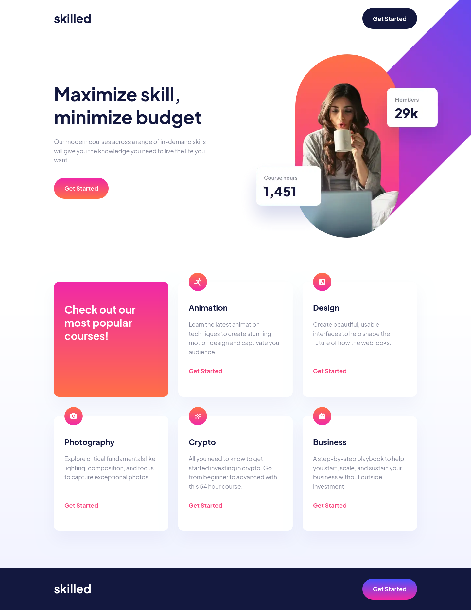

# Frontend Mentor - Skilled e-learning landing page solution

This is a solution to the [Skilled e-learning landing page challenge on Frontend Mentor](https://www.frontendmentor.io/challenges/skilled-elearning-landing-page-S1ObDrZ8q). Frontend Mentor challenges help you improve your coding skills by building realistic projects.

## Table of contents

- [Overview](#overview)
  - [The challenge](#the-challenge)
  - [Screenshot](#screenshot)
  - [Links](#links)
- [My process](#my-process)
  - [Built with](#built-with)
  - [What I learned](#what-i-learned)
- [Author](#author)

## Overview

### The challenge

Users should be able to:

- View the optimal layout depending on their device's screen size
- See hover states for interactive elements

### Screenshot

### Links

- [Solution URL](https://github.com/razouck/skilled_elearning_landing_page)
- [Live Site URL](https://razouck.github.io/skilled_elearning_landing_page/)

## My process

### Built with

- CSS Grid
- CSS Nesting
- CSS custom properties
- Flexbox
- Mobile-first workflow
- Semantic HTML5 markup

### What I learned

I learned how to use the picture element.

## Author

- Frontend Mentor - [@razouck](https://www.frontendmentor.io/profile/razouck)
- Github - [@razouck](https://www.github.com/razouck)
- Twitter - [@razouck](https://www.twitter.com/razouck)
